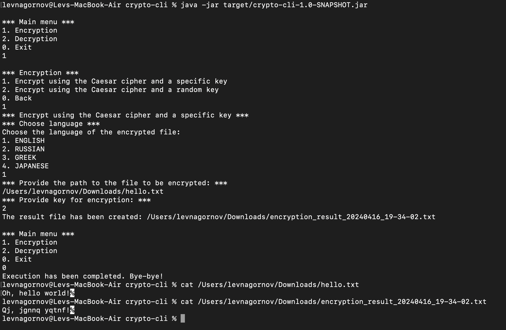
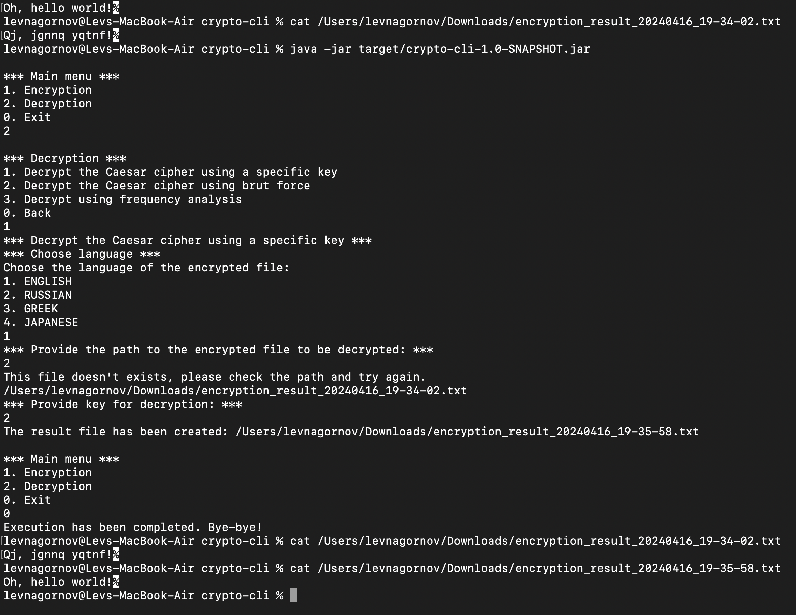

<div align="center">
    <h1>Crypto CLI</h1>
    
</div>

[](LICENSE)
[](https://github.com/RichardLitt/standard-readme)

## Description

This СLI app works with the Caesar cipher.

This is one of the simplest and most famous encryption methods. Perhaps I can add the ability to work with other ciphers, but this is not certain.
Program functionality:

- Text encryption
- Decrypting text using a key
- Decrypting text using brute force (searching through all options)
- Decrypting text using statistical text analysis (to be done later)

The program opens a text file specified by the user and performs one of the above actions with it.
After this, a new file with the result is created in the same directory.

Created by Lev Nagornov.

## Table of Contents

- [Install](#install)
- [Usage](#usage)
- [Contributing](#contributing)
- [License](#license)

## Install

1. Clone the repository using:

    ```
    git clone git@github.com:levnagornov/crypto-cli.git
    ```

2. Install Java if needed:
   ```
   sudo apt update
   sudo apt install default-jdk
   java -version
    ```
   
3. Download and install [Maven](https://maven.apache.org/download.cgi)

4. Build the project
   ```
   cd crypto-cli
   mvn package
    ```
   
5. Run the app
   ```
   java -jar target/crypto-cli-1.0-SNAPSHOT.jar
    ```

## Usage

1. Start the app.
2. Select options by typing number and hit enter to confirm
3. Provide an encrypted file
4. Check result



<br>



## Contributing

PRs accepted.

Small note: If editing the Readme, please conform to the [standard-readme](https://github.com/RichardLitt/standard-readme) specification.

## License

[MIT © Lev Nagornov.](./LICENSE)
